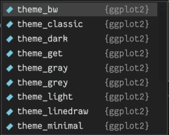

Gerar visualizações de dados é tarefa comum em qualquer processo de análise. Inspecionar
visualmente nossas variáveis nos permite observar padrões, detectar erros, identificar
_outliers_, etc. Embora o R conte com sua máquina padrão para gerar visualizações, é
possível obter gráficos muito mais elaborados e de maneira mais simples com o pacote
`ggplot2` que faz parte do `tidyverse`. 

Nessa sessão teremos uma breve introdução ao `ggplot2`, um pacote muito útil
que implementa a *gramática dos gráficos* (_grammar of graphics_), um sistema coerente
e elegante na descrição e construção de visualizações. Veremos como gerar alguns dos 
tipos de visualizações mais comuns, bem como modificar aspectos estéticos e textuais
dos nossos gráficos. Isso nos ajudará na nossa próxima sessão onde discutiremos 
estatísticas descritivas.

## _The grammar of graphics_

Todo gráfico em `ggplot2` é construído em um sistema de camadas que se combinam
para formar uma visualização de dados. 

{width="450px"}

Ao longo deste material provalmente utilizaremos todas as camadas da imagem acima,
no entanto, nosso foco no momento são as camadas principais de **Data**, **Aesthetics** e **Geometries**.

* **Data**: Aqui informamos qual conjunto de dados utilizaremos para o gráfico.

* **Aesthetics**: Nesta camada **mapeamos** cada variável aos eixos X e Y do gráfico.

* **Geometries**: Aqui decidimos qual tipo de gráfico (geometria) utilizar. Barras,
Linhas, Pontos, Célula, etc.


Definidas estas três camadas, temos uma visualização básica em `ggplot`.

::: {.callout-note appearance="simple"}

## Importante!

Como mencionamos anteriormente, o `ggplot` usa um **sistema de camadas**, e por isso
**a ordem das camadas importa!** Na construção do gráfico é como se empilhassemos uma
sobre a outra, assim, a camada adicionada por último fica no "topo" da visualização.
  
:::


## Nosso primeiro plot

```{r}
library(palmerpenguins, quietly = T)
library(tidyverse)
```


Para nossos exemplos nessa sessão vamos utilizar os dados do pacote `palmerpenguins`,
caso não tenha o pacote pode instalá-lo com `install.packages("palmerpenguins")`.

O pacote contém dados morfométricos de diferentes espécies de pinguins coletados em
diferentes ilhas. Vamos dar uma olhada nos dados?

```{r}
glimpse(penguins)
```

Vamos construir nosso gráfico passo a passo. Primeiro, vamos definir nossa primeira
camada, a de dados. A função `ggplot()` é a que utilizaremos para construir nosso
gráfico base, e todas as camadas subsequentes serão adicionadas, literalmente, ao
nosso gráfico utilizando um `+` ao final de cada linha do gráfico.

```{r}
ggplot(data = penguins)
```

Estranho? Nosso gráfico só exibe até o momento nosso **canvas**, é como se nosso
gráfico fosse uma folha em branco. Vamos adicionar agora nossa camada de mapeamento
dos dados (**aesthetics**).

Será que existe alguma relação entre as variáveis `bill_length_mm` e `flipper_length_mm`?
Pinguins com um bico maior também possuem maiores nadadeiras?

Para isso vamos usar o argumento `aes()` dentro da nossa função `ggplot()` e mapear
cada variável em um eixo do gráfico.

```{r}
ggplot(data = penguins, aes(x = bill_length_mm, y = flipper_length_mm))
```

Nosso gráfico começa a tomar forma. Já podemos ver as unidades adicionadas em
cada eixo, bem como os rótulos das nossas variáveis. Que tal utilizarmos um gráfico
de pontos, ou **gráfico de dispersão** para observamos a relação entre essas duas
variáveis? Para isso vamos adicionar agora uma camada de **geometry** de pontos
com a função `geom_point()`.

```{r}
ggplot(data = penguins, aes(x = bill_length_mm, y = flipper_length_mm)) +
  geom_point()
```

Realmente parece haver uma relação positiva entre as duas variáveis baseado na
inspeção visual. Mas ainda podemos melhorar nosso gráfico.

Além de mapear nossas observações nos eixos, também podemos mapear variáveis
categóricas facilitando assim a visualização de diferentes grupos nos dados.
Para isso podemos declarar dentro do `aes()` uma variável categórica como `species`
para colorir os grupos de observações.


```{r}
ggplot(data = penguins, 
       aes(x = bill_length_mm,
           y = flipper_length_mm,
           color = species)) +
  geom_point()
```

Muito mais intuitivo não? Além do atributo `color`, ainda podemos mapear categorias
a outros atributos como `shape`, para mapear um tipo de ponto para cada grupo dentro
de `species`. Vamos tentar?

```{r}
ggplot(data = penguins, 
       aes(x = bill_length_mm,
           y = flipper_length_mm,
           color = species,
           shape = species)) +
  geom_point()
```

Simples não? Podemos também modificar atributos específicos da camada de geometria,
como seu tamanho, opacidade, etc. Vamos aumentar um pouco o tamanho dos pontos no
nosso gráfico para ficar mais legível, e diminuir a opacidade de modo que os pontos
que estejam sobrepostos possam ser visualizados.

```{r}
ggplot(data = penguins, 
       aes(x = bill_length_mm,
           y = flipper_length_mm,
           color = species,
           shape = species)) +
  geom_point(size = 4,
             alpha = 0.5)
```

Podemos melhorar também a parte textual do nosso gráfico, incluindo um título principal,
e também dando melhores títulos a nossos eixos. Para isso usamos outra camada, a de 
`labs()`, ou rótulos.

```{r}
ggplot(data = penguins, 
       aes(x = bill_length_mm,
           y = flipper_length_mm,
           color = species,
           shape = species)) +
  geom_point(size = 4,
             alpha = 0.5)+
  labs(title = "Relação entre Comprimento de Nadadeira e Bico em Pinguins de 3 espécies",
       x = "Comprimento do Bico (mm)",
       y = "Comprimento de Nadadeira",
       color = "Espécies",
       shape = "Espécies")
  
```

## Geometrias

Outra visualização muito comum são gráficos de barra. A lógica segue a mesma,
definimos os dados, o mapeamento e a geometria. Aqui temos uma diferença, já que
queremos mapear em um dos eixos nossas espécies, e em outro nossa variável de interesse.

```{r}
ggplot(data = penguins, 
       aes(x = species,
           y = flipper_length_mm,
           fill = species)) +
  geom_bar(stat="identity")
```

Aqui precisamos adicionar ao `geom_bar()` o argumento `stat="identity"`, isso porque
como não queremos calcular nenhuma estatística (frequência por exemplo), precisamos
explicitar ao `ggplot` para que use os valores fornecidos pela nossa própria variável.

Em outras sessões veremos maneiras de manipular nossos conjuntos de dados de maneira
que possamos plotar múltiplas variáveis em um único gráfico de barras.

Uma outra representação muito comum é o **Histograma**, que nos permite visualizar como
estão distribuídas as observações de determinada variável. Podemos modificar diversos
aspectos da geometria tornando o gráfico mais visualmente interessante.

```{r}
ggplot(data = penguins, 
       aes(x = flipper_length_mm)) +
  geom_histogram(fill = "skyblue", color = "darkblue", alpha = 0.6)
```

Gráficos de linha são excelentes visualizações para comparar mudanças ao longo de
um gradiente como tempo, concentrações, etc. Para criarmos uma série de dados que
possam ser plotadas em um gráfico de linhas vamos fazer algumas transformações nos
nossos dados, mas não se preocupe se não entender as operações agora, ao longo do
material você irá explorar esses conceitos e operações com detalhes.

Eu quero comparar como o peso corporal `body_mass_g` variou ao longo do tempo `year`
entre as espécies. 

```{r}
penguins |>
  group_by(species,year) |>
  mutate(body_mass_kg = body_mass_g/1000) |>
  summarize(mean_bm = mean(body_mass_kg, na.rm = TRUE)) |>
  ggplot(aes(x = factor(year), y = mean_bm, group = species, color = species)) +
  geom_line(linewidth = 1) +
  labs(title = "Peso corporal de Pinguins de 3 ilhas",
       x = "Ano",
       y = "Peso Médio (kg)",
       color = "Espécie:")
```

Uma outra camada do `ggplot` é a de temas. Podemos aplicar temas pré-definidos no pacote,
ou em pacotes extras como `ggthemes`, bem como podemos construir temas do zero. Para utilizar um tema pré definido
basta invocar `theme_` e as opções aparecerão. Experimente e veja as diferenças e
aplicabilidades de cada tema.

{with="300px"}


Não abordarei a construção de temas nesse material, mas é bem fácil encontrar na
própria documentação do pacote como fazê-lo.


```{r}
penguins |>
  group_by(species,year) |>
  mutate(body_mass_kg = body_mass_g/1000) |>
  summarize(mean_bm = mean(body_mass_kg, na.rm = TRUE)) |>
  ggplot(aes(x = factor(year), y = mean_bm, group = species, color = species)) +
  geom_line(linewidth = 1) +
  labs(title = "Peso corporal de Pinguins de 3 ilhas",
       x = "Ano",
       y = "Peso Médio (kg)",
       color = "Espécie:") +
  theme_classic()
```

A versatilidade do `ggplot` permite a criação de visualizações de dados complexas
e bastante informativas. Uma coisa importante é sempre ter em mente que planejar
o objetivo de sua visualização é o mais fundamental. Uma vez que se sabe a ideia que
desejamos transmitir, transformar os dados para o formato ideal e montar a imagem
é bastante intuitivo. Ao longo deste curso praticaremos bastante a criação de gráficos.

