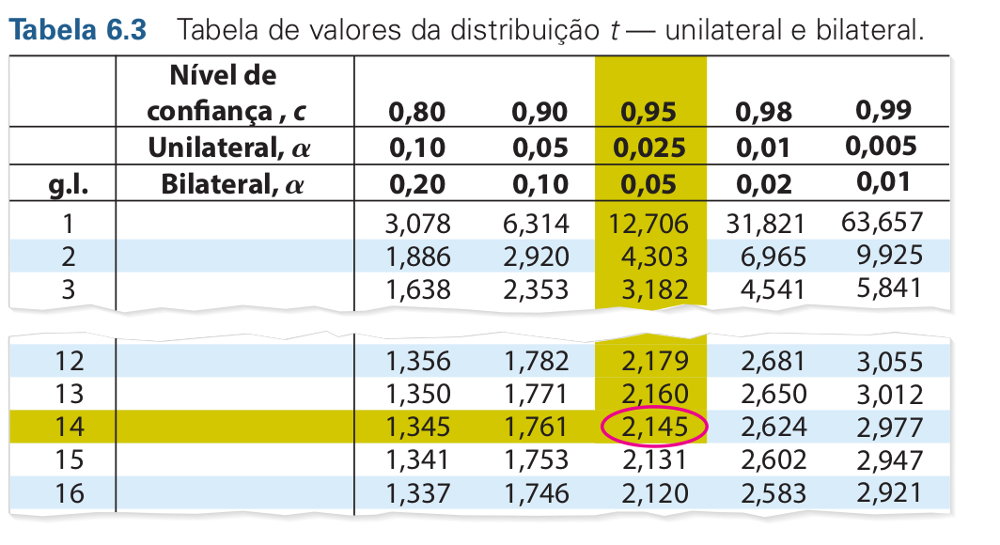

Nesta sessão discutiremos brevemente os conceitos de Intevalo de Confiança,
Teste de Hipótese, p-valor e nível de significância. Compreender esses conceitos
é fundamental uma vez que eles são a base dos testes estatísticos que utilizaremos
daqui pra frente. 

Esse material não tem a intenção de ser uma discussão aprofundada sobre estes 
conceitos, para os mais interessados sugiro a leitura de fontes complementares
a exemplo dos livros:

* Inferência Estatística - Casella e Berger

* Estatística Prática para Cientistas de Dados - Bruce e Bruce - O'Reilly


## Intervalos de Confiança

Estimativas como a média amostral $\large (\bar{x})$ nos _fornecem um único valor
plausível para um parâmetro_. Estas estatísticas são chamadas de **estimativas pontuais**.
Mas sabemos que existe um erro associado a toda estimativa, e o próximo passo
natural seria fornecer um _intervalo plausível de valores_ para o parâmetro, isto
é o que chamamos de **intervalo de confiança (IC)**.

A porcentagem associada ao IC é chamada **nível de confiança**. Quanto maior o nível
de confiança, maior o intervalo, e quanto menor a amostra, maior o intervalo, ou
seja, maior a incerteza. Os níveis de confiança mais comuns são 90%, 95% ou 99%.

Mas o que de fato _"95% de confiança"_ significa?

O real significado de confiança deve ser compreendido a partir do ponto de vista
de um processo generativo. Imagine que amostramos muitas (infinitas) amostras de
uma população, e construimos ICs de 95% para cada amostra. Assim, 95% destes ICs
que foram construídos provavelmente contém o atual valor do parâmetro que queremos
estimar.

## Margem de Erro $E$  

A diferença entre a estimativa pontual $\bar{x}$ e o parâmetro populacional $\mu$
é chamada de **erro de amostragem** ou **erro amostral**.

Para uma média populacional $\mu$ em que conhecemos o $\sigma$, dado um nível de
confianaça $c$, podemos estimar $E$ com:

$$
E = Z_c\frac{\sigma}{\sqrt{n}}
$$

Desde que atendidas duas condições:

1. A amostra é aleatória;

2. A população é normalmente distribuída ou n $\geq$ 30;

Assim, construímos um intervalo de confiança para $\mu$ como sendo:

$$\large \bar{x}-E < \mu < \bar{x} + E$$

Em uma distibuição normal padrão, os valores tabelados usuais para $Z_c$ encontram-se
na tabela abaixo:

| Confidence Level | 90%  | 95%  | 99%  | 99.9% |
|------------------|------|------|------|-------|
| $Z \ Value$         | 1.65 | 1.96 | 2.58 | 3.291 |


<br>

Entretanto, na maioria das vezes $\sigma$ é desconhecido, e utilizamos o desvio
padrão amostral $S$ para estimar $E$. Quando a variável aleatória é normalmente
(ou aproximadamente normalmente) distribuída, a média amostral segue **distribuição $t$** 
com graus de liberdade $n-1$.

Dessa forma, estimamos o erro padrão por:


$$
E = t_c\frac{S}{\sqrt{n}}
$$

Para obtermos o valor de $t_c$ consultamos a tabela de valores da distribuição $t$. Podemos
também obter os valores de $t_c$ usando o R. Por exemplo, se quisermos saber o valor
tabelado para um alfa de 0.05 com 14 graus de liberdade.

:::{.columns}
:::{.column  width="40%"}
```{r}
qt(0.975, df = 14)
```

0.975 = 1 - (0.05 / 2), porque é bilateral e você divide α pelas duas caudas

:::
:::{.column  width="60%"}
{width="500px"}
:::
:::

| Tipo de Teste   | Quantos lados? | Significado                              | Quando usar?                                                      |
|-----------------|----------------|------------------------------------------|-------------------------------------------------------------------|
| Unilateral      | 1 cauda        | Testa se a média é **maior ou menor**    | Quando você tem uma hipótese com **direção definida** (ex: "maior que") |
| Bilateral       | 2 caudas       | Testa se a média é **diferente**         | Quando a hipótese alternativa **não tem direção** (ex: "diferente de")  |


