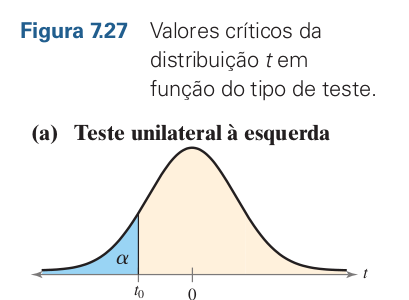
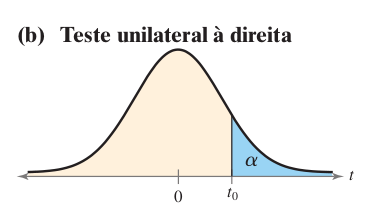
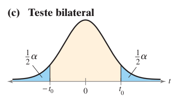

```{r}
#| echo: false
library(extrafont)
```

<br>

[]{.aside}

O Teste $\large t$ de Student foi proposto por William Sealy Gosset. O nome 
_Student_ se deve ao fato de Gosset ser funcionário da cervejaria Guinness e
utilizava o pseudônimo de Student em suas publicações. O teste $t$ utiliza a
*distribuição $t$*, que pode ser imaginada com uma versão da distribuição
normal para pequenas amostras. Gosset precisava desta alternativa para comparar
experimentos na cervejaria, muitos com amostras pequenas. 

Gosset não tinha
nenhuma intenção em causar impacto na estatística, seu teste buscava resolver
uma questão prática e aplicada dentro da sua área de atuação. Seu teste entretanto
é de enorme importância até hoje e destaca o quanto a significância de domínio
(biológica, ecológica, econômica...) deve sempre preceder a significância
estatística [@hector2021new].


## Qual Teste $t$?

Existem dois tipos de teste. 

  * Para duas amostras independentes;
  
  * Para duas amostras pareadas.
  
No primeiro caso, nosso objetivo é comparar duas amostras obtidas de maneira
independente. Por exemplo: massa foliar de plantas submetidas a dois tipos
de tratamento, peso de camundongos alimentados com dietas com dois teores de 
proteína, etc.

No caso de amostras paredas, não temos independência pois desejamos medir o
efeito sob um mesmo grupo de indivíduos/amostas. Por exemplo: comprimento do
pelo de um grupo de Chinchilas antes e depois de submetidos a uma dieta, riqueza
de espécies em uma área antes e depois de um episódio de queimada, etc.

Em cada caso, os testes necessitam obedecer a premissas que veremos mais em
detalhes a seguir.

Outro aspecto importante diz respeito a como formulamos a Hipótese Nula ($H_0$)
e em consequência a Hipótese Alternativa ($H_a$). Cada gráfico mostra uma curva
de distribuição $t$, e as áreas azuis $(\alpha)$ representam as *regiões críticas*
onde rejeitamos a hipótese nula ($H_0$). Vamos ver cada um:

*** 

:::{.columns}
:::{.column  width="35%"}
{width="350"}
:::
:::{.column  width="65%"}

* A área azul está à esquerda da curva.

* Esse teste é usado quando queremos saber **se a média é menor** que um valor específico.

::: {.content-hidden when-format="pdf"}
| **$\large H_0$**  | **$\large H_a$**              |
|--------------------|--------------------|
| $\mu_1 \geq \mu_2$ | $\mu_1 < \mu_2$    |

: Cauda a esquerda {.striped .hover .tbl-forty}
:::

\begin{tabular}{>{\centering\arraybackslash}m{3cm} >{\centering\arraybackslash}m{3cm}}
\toprule
$H_0$ & $H_a$ \\
\midrule
$\mu_1 \geq \mu_2$ & $\mu_1 < \mu_2$ \\
\bottomrule
\end{tabular}

Rejeitamos $H_0$ se o valor de $t$ calculado cair na cauda esquerda da curva 
(menor que $t_0$).
:::
:::

***

:::{.columns}
:::{.column  width="35%"}
{width="350"}
:::
:::{.column  width="65%"}

* A área azul está à direita da curva.

* Esse teste é usado quando queremos saber **se a média é maior** que um valor específico.

::: {.content-hidden when-format="pdf"}
| **$\large H_0$**  | **$\large H_a$**              |
|--------------------|--------------------|
| $\mu_1 \leq \mu_2$ | $\mu_1 \gt \mu_2$    |

: Cauda a direita {.striped .hover .tbl-forty}
:::

\begin{tabular}{>{\centering\arraybackslash}m{3cm} >{\centering\arraybackslash}m{3cm}}
\toprule
$H_0$ & $H_a$ \\
\midrule
$\mu_1 \leq \mu_2$ & $\mu_1 > \mu_2$ \\
\bottomrule
\end{tabular}

Rejeitamos $H_0$ se o valor de $t$ calculado cair na cauda direita da curva 
(maior que $t_0$).
:::
:::

***

:::{.columns}
:::{.column  width="35%"}
{width="350"}
:::
:::{.column  width="65%"}

* Agora há duas regiões críticas, uma em cada cauda (esquerda e direita).

 * Esse teste é usado quando queremos saber **se a média é diferente**, seja para
 mais ou para menos.

::: {.content-hidden when-format="pdf"}
| **$\large H_0$**  | **$\large H_a$**              |
|--------------------|--------------------|
| $\mu_1 = \mu_2$ | $\mu_1 \neq \mu_2$    |

: Bilateral {.striped .hover .tbl-forty}
::: 


\begin{tabular}{>{\centering\arraybackslash}m{3cm} >{\centering\arraybackslash}m{3cm}}
\toprule
$H_0$ & $H_a$ \\
\midrule
$\mu_1 = \mu_2$ & $\mu_1 \neq \mu_2$ \\
\bottomrule
\end{tabular}

Rejeitamos $H_0$ se o valor de $t$ for muito pequeno ou muito grande
(cair em qualquer uma das duas caudas).

O valor de $\alpha$ (nível de significância) é dividido ao meio: metade em cada cauda.
:::
:::

::: {.callout-note}
## Importante
  
  Para as próximas etapas nesta sessão utilizaremos dados do pacote `ecodados`,
  vocês podem fazer a instalação rodando `devtools::install_github("paternogbc/ecodados")`.
  Este pacote é parte do excelente livro
  [Análises Ecológicas no R de @da2022analises](https://analises-ecologicas.com/){target="_blank"} e
  é simplesmente um dos melhores livros dedicados a ciência de dados para Ecologia,
  disponível gratuitamente na internet. Obrigado aos autores mais uma vez! 
  
:::

## Pacotes Necessários

Nesta sessão utilizaremos alguns pacotes auxiliares, são eles:

`car`, `ecodados`, `tidyverse`, `ggpubr`

Caso ainda não tenha instalado, basta rodar:

```{r}
#| eval: false
install.packages(c(`car`, `ecodados`, `tidyverse`, `ggpubr`))
```


## Teste $t$ independente

Um teste t baseado em duas amostras é usado para testar a diferença entre duas 
médias populacionais $\mu_1$ e $\mu_2$ quando $\sigma_1$ e $\sigma_2$ são desconhecidos,
e portanto usamos os desvios amostrais.


$$t = \frac{\bar{x_1}-\bar{x_2}}{s}\sqrt{\frac{n_1\times n_2}{n_1 + n_2}}$$

Premissas do Teste $t$:

1. As amostras devem ser independentes
2. As unidades amostrais são selecionadas aleatoriamente
3. Distribuição normal (gaussiana) dos resíduos
4. Homogeneidade da variância


### Exemplo 1

Usaremos os dados de comprimento rostro-cloacal (CRC) de machos de anfíbios da
espécie _Physalaemus nattereri_ (Anura:Leptodactylidae) amostrados em diferentes
estações do ano.

**Pergunta:** Existe diferença na média co CRC em _P. nattereri_ entre as estações?

**Hipótese Nula:** As médias de CRC são iguais.

**Hipótese Alternativa:** As médias de CRC são diferentes entre as estações.

Antes de realizarmos o teste $t$, precisamos nos certificar de que nossos dados
atendem as premissas.

```{r}
#| message: false
#| warning: false
library(tidyverse, quietly = TRUE)

crc_phy_nat <- ecodados::teste_t_var_igual

glimpse(crc_phy_nat)

```

[**QQ plot (Quantile-Quantile plot)** é um gráfico que compara os quantis dos seus dados com os quantis de uma distribuição teórica (geralmente normal) para verificar se os dados seguem essa distribuição.]{.aside}

Para avaliar a normalidade dos resíduos podemos fazer visualmente através de um
**QQ-Plot**.

Vamos falar em Regressão Linear em uma sessão futura, por enquanto saiba que estaremos
utilizando um modelo super simples de $CRC \sim Estação$ (CRC _em função das_ Estações)
e capturando os resíduos deste modelo para testar sua normalidade. 

```{r}
mod <- lm(CRC ~ Estacao, data = crc_phy_nat)

car::qqPlot(mod)

```

Os pontos se aproximam bastante da reta, o que nos sugere que nossos resíduos
**são normalmente distribuídos**.

Podemos ainda utilizar o teste de Shapiro-Wilk e avaliar a normalidade e a
heterocedasticidade (homogeneidade) da variância.

```{r}
shapiro.test(residuals(mod))
```

Testando a variância com o teste de Levene

```{r}
car::leveneTest(mod)
```

A Hipótese nula de ambos os testes é a de que os resíduos apresentam distribuição
normal (Shapiro-Wilk) ou a variância é homogênea (Levene). Portanto na hora de
interpretar os p-valores:

* $\large p<0.05$: Rejeitamos $H_0$, resíduos não seguem normalidade/homogeneidade
de variância.

* $\large p>0.05$: Deixamos de rejeitar $H_0$, resíduos são normais e variância é
homogênea.

Uma vez satisfeitas as premissas, podemos prosseguir e realizar o teste $t$:

```{r}
teste_T <- t.test(CRC ~ Estacao, data = crc_phy_nat,
                  var.equal = TRUE)

teste_T

```

Observe o argumento `var.equal=TRUE`, isso informa a função que nossa variância
é homogênea. Isto é importante, pois em caso de variâncias não homogêneas há uma
alteração no estimador utilizado para calcular a estatística $t$.

Ao apresentar os seu resultados inclua:

i. A estatística $t$: $t = 4.1524$

ii. O p-valor: $p-value = 0.000131$

iii. Graus de Liberdade: $df = 49$

iv. Diferenca entre as médias: $0.434$

Usando a função `tidy` do pacote `broom` você pode montar uma tabela mais amigável
com todos esses dados além de outros interessantes como intervalo de confiança.

```{r}
library(gt)


options(scipen = 0)
labels <- c("Diferença Entre as Médias","Media_1",
            "Media_2","Estatística t","p-valor",
            "Gl","IC Inf","IC Sup")

broom::tidy(teste_T) |>
  select(estimate:conf.high) |>
  rename_all(~labels) |>
  pivot_longer(everything(),
               values_to = "Valor",
               names_to = "Desc") |>
  gt() |>
  fmt_number(
    columns = Valor,
    decimals = 2,
    rows = Desc != "p-valor" & Desc != "Gl"
  ) %>%
  fmt_number(
    columns = Valor,
    decimals = 0,
    rows = Desc == "Gl"
  ) %>%
  cols_label(
    Desc = "Descrição",
    Valor = "Valor"
  )
```

Outra opção é apresentar um gráfico de BoxPlot com as médias para cada estação e
as observações.

::: {.content-visible when-format="html"}
```{r}
#| fig-cap: Código adaptado de @da2022analises
#| fig-cap-location: margin

extrafont::loadfonts(quiet = TRUE)

ggplot(data = crc_phy_nat, aes(x = Estacao, y = CRC, color = Estacao)) + 
    labs(x = "Estações", 
         y = expression(paste("CRC (mm) - ", italic("P. nattereri")))) +
    geom_boxplot(fill = c("#606c38", "#dda15e"), color = "black", 
                 outlier.shape = NA) +
    geom_jitter(shape = 21, position = position_jitter(0.1), 
                cex = 3, alpha = 0.7, stroke = .8,
                fill = "grey60") +
    scale_color_manual(values = c("black", "black")) +
    annotate("text",
             label ="t = 4.1524",
             size = 4,
             x = "Seca",
             y = 4.6,
             hjust = 0,
             family = "Ubuntu") +
    annotate("text",
               label ="DF = 49",
               size = 4,
               x = "Seca",
               y = 4.5,
               hjust = 0,
               family = "Ubuntu") +
    annotate("text",
               label ="Estimate: 0.434",
               size = 4,
               x = "Seca",
               y = 4.4,
               hjust = 0,
               family = "Ubuntu") +
    annotate("text",
               label ="p-value = 0.000131",
               size = 4,
               x = "Seca",
               y = 4.3,
               hjust = 0,
               family = "Ubuntu") +
    theme_classic(base_size = 14,
                  base_family = "Ubuntu") +
    theme(legend.position = "none")
```
:::

::: {.content-visible when-format="pdf"}
```{r}
ggplot(data = crc_phy_nat, 
       aes(x = Estacao, y = CRC, color = Estacao)) + 
    labs(x = "Estações", 
         y = expression(paste("CRC (mm) - ",
                              italic("P. nattereri")))) +
    geom_boxplot(fill = c("#606c38", "#dda15e"),
                 color = "black", 
                 outlier.shape = NA) +
    geom_jitter(shape = 21, position = position_jitter(0.1), 
                cex = 3, alpha = 0.7, stroke = .8,
                fill = "grey60") +
    scale_color_manual(values = c("black", "black")) +
    annotate("text",
             label ="t = 4.1524",
             size = 4,
             x = "Seca",
             y = 4.6,
             hjust = 0) +
    annotate("text",
               label ="DF = 49",
               size = 4,
               x = "Seca",
               y = 4.5,
               hjust = 0) +
    annotate("text",
               label ="Estimate: 0.434",
               size = 4,
               x = "Seca",
               y = 4.4,
               hjust = 0) +
    annotate("text",
               label ="p-value = 0.000131",
               size = 4,
               x = "Seca",
               y = 4.3,
               hjust = 0) +
    theme_classic(base_size = 14) +
    theme(legend.position = "none")
```
:::

## Teste $t$ pareado

No teste $t$ pareado temos duas observações da mesma unidade amostral subetida
ao tratamento/efeito de interesse. O nosso objetivo é determinar se a diferença
entre observações é zero.

[{.lightbox}]{.aside}

Premissas:

1. As unidades amostrais são selecionadas aleatoriamente
2. As observações *não são independentes*
3. Distribuição normal (gaussiana) dos valores da diferença para cada par


### Exemplo 2

Novamente vamos utilizar dados do pacote `ecodados` seguindo o exemplo disponível
em @da2022analises. Vamos utilizar dados de riqueza de espécies de artrópodes em
uma área antes e depois de um processo de queimada.

**Pergunta:** A riqueza de espécies de artrópodes é afetada pelas queimadas?

**Hipótese Nula:** A riqueza de espécies é igual antes e depois.     

```{r}
art_rich <- ecodados::teste_t_pareado

art_rich |>
  glimpse()

art_rich |>
  count(Estado)
```

A função é a mesma `t.test()`, porém precisamos informar que agora estamos avaliando
dados pareados, isso é feito pelo argumento `paired = TRUE`. Uma outra diferença
é que para o teste pareado, não podemos utilizar a notação de fórmula, precisamos
declarar explicitamente nossos dois vetores de observações. O restante da análise
segue a anterior. 

```{r}

rich_antes <- art_rich |>
  filter(Estado == "Pre-Queimada") |>
  pull(Riqueza)

rich_depois <- art_rich |>
  filter(Estado == "Pos-Queimada") |>
  pull(Riqueza)

par_T <- t.test(x = rich_antes, y = rich_depois, paired = TRUE)

par_T
```

A saída da versão pareda apresenta menos informações que a de amostras independentes,
mas nossos valores importantes continuam lá. Temos que $t = 7.5788$, $df = 26$, $p-value = 4.803e-08$, além do nosso IC(95%) e a diferença entre as médias de $44.55$.

Como no exemplo anterior podemos apresentar nossos resultados de maneira gráfica.
A função `ggpaired()` do pacote `ggpubr` nos fornece uma maneira bastante didática
de apresentar nossos resultados.

```{r}
#| fig-cap: Código adaptado de @da2022analises
#| fig-cap-location: margin

ggpubr::ggpaired(art_rich, x = "Estado", y = "Riqueza",
color = "Estado", line.color = "gray", line.size = 0.8,
palette = c("#606c38", "#dda15e"), width = 0.5,
point.size = 4, xlab = "Estado das localidades",
ylab = "Riqueza de Espécies") +
expand_limits(y = c(0, 150)) +
theme_classic(base_size = 14, base_family = "Ubuntu") +
  theme(legend.direction = "horizontal",
        legend.position = "top")

```


