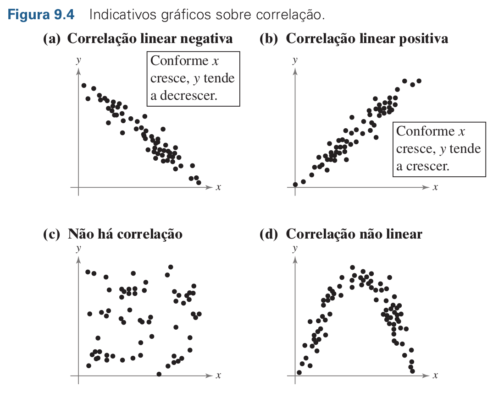

```{r}
#| echo: false
#| warning: false
#| message: false
library(tidyverse, quietly = T)
library(extrafont)
```


Nesta sessão vamos estudar como descrever e testar a significância das relações
entre duas variáveis. Veremos uma introdução a correlação linear, variáveis 
independentes e dependentes e tipos de correlação. Abordaremos como calcular o
coeficiente de Correlação de Pearson e como distinguir correlação e causalidade.


## Correlação

> Uma **correlação** é uma relação entre duas variáveis. Os dados podem ser
representados por pares ordenados (x, y), sendo x a **variável independente**
(ou explanatória) e y a **variável dependente** (ou resposta). [@larson2023estatistica]

Um gráfico de dispersão é uma ótima ferramenta para avaliar a relação entre
duas variáveis. Considere o seguinte conjunto de dados:


| PIB <br> (em trilhões de dólares) | Emissões de CO~2~ <br> (em milhões de toneladas métricas) |
|:----------------------------------:|:---------------------------------------------------------:|
| 1,7                              | 552,6                                                   |
| 1,2                              | 462,3                                                   |
| 2,5                              | 475,4                                                   |
| 2,8                              | 374,3                                                   |
| 3,6                              | 748,5                                                   |
| 2,2                              | 400,9                                                   |
| 0,8                              | 253,0                                                   |
| 1,5                              | 318,6                                                   |
| 2,4                              | 496,8                                                   |
| 5,9                              | 1.180,6                                                 |

: Dados do PIB e da quantidade de CO~2~ emitida de 10 países. Adaptado de @larson2023estatistica {.tbl-sixty}

```{r}

dados_pib_co2 <- tibble(
  PIB = c(1.7, 1.2, 2.5, 2.8, 3.6, 2.2, 0.8, 1.5, 2.4, 5.9),
  CO2 = c(552.6, 462.3, 475.4, 374.3, 748.5, 400.9, 253.0, 318.6, 496.8, 1180.6)
)

library(ggtext)

ggplot(dados_pib_co2,
       aes(x = PIB, y = CO2)) +
  geom_point(shape = 21, size =4, fill = "grey70", color = "black")+
  theme_bw(base_size = 14, base_family = "Ubuntu") +
  scale_x_continuous(breaks = 1:6) +
  scale_y_continuous(breaks = seq(0,1200,by = 200))+
  labs(title = "Relação entre PIB e a quantidade de CO2 emitida,
       para amostra com 10 países.",
       x = "PIB <br> (em trilhões de dólares)",
       y = "CO<sub>2</sub> <br> (em milhões de toneladas métricas)") +
  theme(axis.title = element_markdown())

```

Podemos observar no gráfico uma tendência. As emissões de CO~2~ parecem aumentar
com o aumento do PIB. 

Mas não podemos garantir que a relação entre as variáveis exista simplesmente por
uma inspeção visual. Para tanto precisamos de um **coeficiente de correlação** que
nos forneça a informação da força e direção da correlação entre estas variáveis.

> O **coeficiente de correlação** é uma medida da força e da direção de uma
relação linear entre duas variáveis. O símbolo $r$ representa o coeficiente de
correlação amostral. [@larson2023estatistica]


$$r = \frac{\sum_{i=1}^{n} (x_i - \bar{x})(y_i - \bar{y})}{\sqrt{\sum_{i=1}^{n} (x_i - \bar{x})^2} \sqrt{\sum_{i=1}^{n} (y_i - \bar{y})^2}}
$$
O **coeficiente de correlação de Pearson** foi proposto por Karl Pearson no final do século XIX como **uma medida estatística da força e direção** da relação linear entre duas variáveis quantitativas. O coeficiente, geralmente representado por $r$, **varia entre -1 e 1**, onde valores próximos a 1 indicam uma correlação positiva forte, valores próximos a -1 indicam uma correlação negativa forte e valores próximos a 0 indicam ausência de correlação linear. A proposta de Pearson representou um avanço importante na estatística, ao permitir quantificar relações entre variáveis de forma objetiva e padronizada, sendo amplamente utilizada até os dias atuais em diversas áreas do conhecimento.

{width="75%"}

**Premissas da Correlação de Pearson:**

1. As amostras devem ser independentes e pareadas (i.e., as duas variáveis devem ser
medidas na mesma unidade amostral)
2. As unidades amostrais são selecionadas aleatoriamente
3. A relação entre as variáveis tem que ser linear

## Calculando $r$

Mais uma vez usaremos dados do `ecodados` de [@da2022analises].

Neste exemplo, avaliaremos a correlação entre a altura do tronco e o tamanho da raiz medidos em 35
indivíduos de uma espécie vegetal arbustiva.


```{r}
arbustos <- ecodados::correlacao

arbustos |> glimpse()
```

Utilizaremos a função `cor.test()` explicitando que queremos o coeficiente de 
Pearson no argumento `method="pearson"`.

```{r}
cor.test(arbustos$Tamanho_raiz,
         arbustos$Tamanho_tronco,
         method = "pearson")
```

A hipótese nula do teste é a de que  as variáveis não são correlacionadas, ou seja,
$H_0: r = 0$. Olhando nosso resultado, uma vez que nosso $p-value = 4.474e-13$,
rejeitamos $H_0$, nossas variáveis são **positivamente** e **fortemente** correlacionadas
dado o valor de $r = 0.8944449$. Podemos comunicar nossos resultados com um gráfico
de dispersão.

```{r}
#| fig-cap-location: margin
#| fig-cap: Adaptado de @da2022analises
#| label: fig-cor
#| lst-label: lst-cor
#| lst-cap: Reta de Regressão

arbustos <- ecodados::correlacao

ggplot(data = arbustos, aes(x = Tamanho_raiz,
y = Tamanho_tronco)) +
labs(x = "Tamanho da raiz (m)", y = "Altura do tronco (m)") +
  geom_smooth(method = lm, se = FALSE, color = "#3e5c76",
linetype = "solid", linewidth=0.7) +
geom_point(size = 4, shape = 21, fill = "#dc2f02", alpha = 0.8) +
annotate("text",
         x = 14, y = 14,
         label = "r = 0.89, P < 0.001",
         color = "black", size = 5,
         family = "Ubuntu") +

theme_classic(base_size = 14, base_family = "Ubuntu") +
theme(legend.position = "none")
```

::: {.callout-note}
## Importante

A linha de tendência tracejada no gráfico é apenas para ilustrar a relação positiva entre as
variáveis. Ela não é gerada pela análise de correlação, e sim por uma regressão linear que veremos
em outra sessão.
:::
