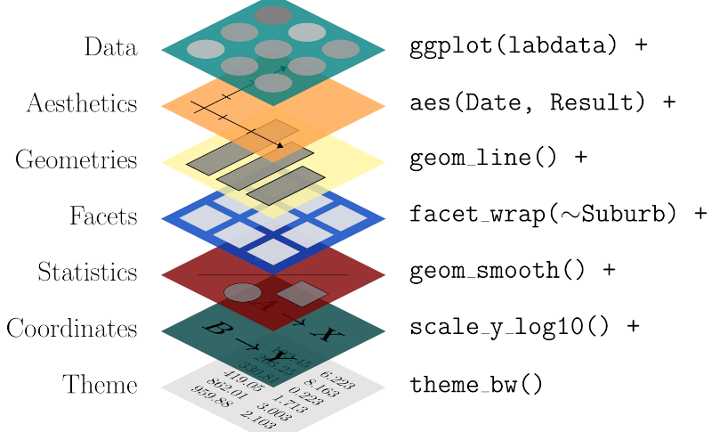
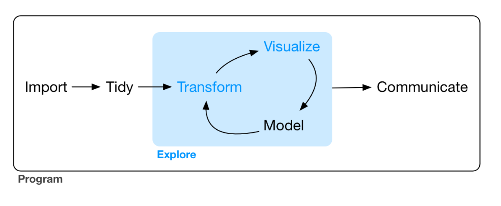
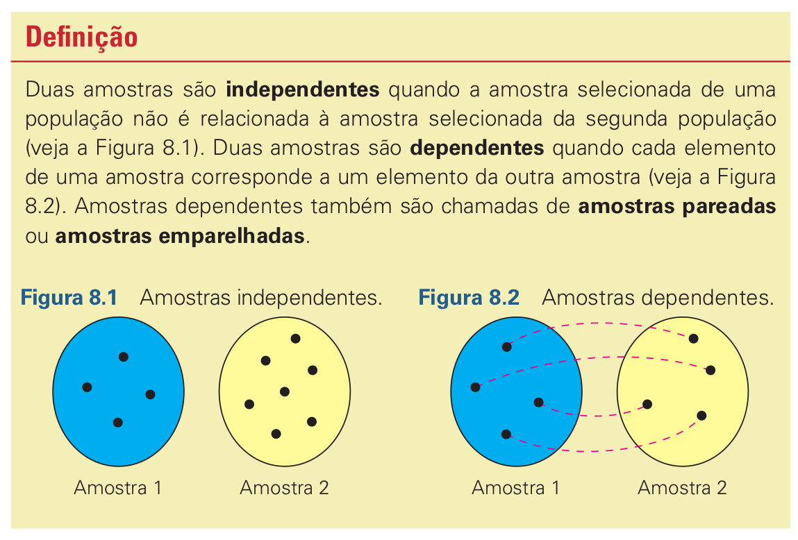

```{r}
#| echo: false
#| warning: false
#| message: false

setwd(here::here("slides")) 
```


## Hi there! 

::: {.v-center-container}

:::{.columns}
:::{.column  width="40%"}
{width="700px"}
:::
:::{.column  .smallbf  width="60%"}
### Paulo Barros

<br>

 **2024 - PhD Zootecnia (Melhoramento Genético Animal) (PPZ-UESB)**

 2024 - MSc Genética, Biodiversidade e Conservação (PPGGBC-UESB)

 2020 - Biologia com Ênfase em Genética (UESB)

<br>

***
:::{.center-col}
:::{.columns } 
:::{.column  width="25%"}


Consultoria Ambiental
:::
:::{.column  width="25%"}


Consultoria Estatística
:::
:::{.column  width="25%"}


Cursos e Mentorias
:::
:::{.column  width="25%"}


Desenvolvimento de Pacotes
:::
:::
:::

:::
:::
:::


## O que aprender pra aprender R...

::: {.v-center-container}
:::{.columns}
:::{.column  width="50%"}
::: {.fragment}

### O jeito difícil...

{width="100%"}
:::
:::
:::{.column  width=""}
::: {.fragment}

### O jeito fácil...

{width="100%"}
:::
:::
:::
:::

::: aside
Imagem por [Allison Horst.](https://allisonhorst.com/everything-else){target="_blank"}
:::


## Encontre sua motivação individual


{width="100%"}


::: aside
Imagem por [Allison Horst.](https://allisonhorst.com/everything-else){target="_blank"}
:::

## Vantagens em aprender R

:::{.v-center-container}

:::{.columns}
:::{.column  width="" .incremental}

* Independência pra rodar suas análises

* Um maior entendimento da sua própria pesquisa

* Oportunidades de carreira

* **Reproducibilidade:** caminha pra se tornar _industry standard_ 
:::

:::{.column  width=""}

:::{.fragment}
{width="400" fig-align="center"}

**e principalmente...**

Você não ter que sair correndo atrás de alguém faltando 15 dias pra sua
qualificação/defesa querendo aprender R pra rodar tuas análises e estatística
pra interpretar teus dados.
:::

:::
:::
  
:::


# Download & Instalação {background-color="#2b2d41ff" background-image="images/install.png" background-size="400px"background-position="80% 50%"}


## Instalando R e R Studio

::: {.v-center-container}

:::{.columns}
:::{.column  width="40%"}


[The Comprehensive R Archive Network - CRAN](https://cran.r-project.org/){target="_blank"}

+ **R-4.5.0** 
  + (2025-04-11, How About a Twenty-Six) 

:::
:::{.column  width="10%"}
:::
:::{.column  width="40%"}
{width="300px"}

[RStudio IDE](https://posit.co/downloads/){target="_blank"}

+ Version 2025.05.0 Build 496

:::
:::
:::


# R Studio {background-color="#2b2d41ff" background-image="https://forum.posit.co/uploads/default/original/3X/c/f/cfd969809f9ee8c5ad30a776ce43728c64cca03d.png" background-size="300px" background-position="60% 50%"}

Ambiente de Desenvolvimento <br>
para linguagem R


## O básico do R


:::{.columns}
:::{.column  width="45%"}
**Matemática Básica**
```{r}
1 / 200 * 30
(59 + 73 + 2) / 3
```

**Comentários**

Qualquer texto precedido de # não é lido como código.

```{r}
# Comentários são úteis
# pra documentar o código

1:5 # cria uma sequência de 1 a 5

```


:::
:::{.column  width="5%"}
:::
:::{.column  width="45%"}
**Objetos**

`object_name <- value`

```{r}
primes <- c(2, 3, 5, 7, 11, 13)

primes
```

`c()` é a função de **c**ombinar elementos. 

**Nomes de Objetos**

Todo objeto no R deve ter o nome iniciado por letra, e só podem conter `_` ou `.`

```
i_use_snake_case
otherPeopleUseCamelCase
some.people.use.periods
And_aFew.People_RENOUNCEconvention
```
:::
:::

## Pacotes

Pacotes são conjuntos de funções combinadas que extendem a capacidade da linguagem R.

Atualmente são mais de **22 mil pacotes** no [CRAN](https://cran.r-project.org/web/packages/index.html){target="_blank"}

:::{.columns}
:::{.column  width="40%"}
**Instalação**

```{r}
#| eval: false
install.packages("tidyverse")
```

**Carregamento**

```{r}
library(tidyverse)
```

<br>

::: {.callout-note}
## Atenção

Instalamos uma única vez (Por versão do R). Carregamos os pacotes todas as vezes
que precisamos utilizar em nossos scripts.  
:::

:::
:::{.column  width="2%"}
:::
:::{.column  width="55%"}
**Datasets**

A maioria dos pacotes vem com _datasets_ de exemplos.

```{r}
#| eval: false
data(package="nome_do_pacote")
```

Para listar todos os datasets

```{r}
#| eval: false
data(package = .packages(all.available = TRUE))
```


:::
:::


# _tidyverse_ {background-color="#FFFFFF" background-image="images/tidyverse.png" background-size="700px"background-position="65% 50%"}

Porque estatística e programação<br>
já são difíceis pra cacete...


## Uma maneira elegante e intuitiva de trabalhar com dados...

Vamos dar uma olhada no dataset `iris` que já vem com o R.

O comando `str()` nos diz a **estrutura** dos dados.

```{r}
str(iris)
```

O comando `head()` exibe as primeiras observações de um objeto.

```{r}
head(iris, 10)
```


## Uma maneira elegante e intuitiva de trabalhar com dados...

:::{.fragment}
**Base R**
```{r}
#| eval: false

setosa_data <- iris[iris$Species == "setosa", ]

sepal_data <- setosa_data[, grepl("^Sepal",names(setosa_data))]

sepal_means <- colMeans(sepal_data)

as.data.frame(t(sepal_means))

```
:::

:::{.fragment}

```{r}
#| echo: false
setosa_data <- iris[iris$Species == "setosa", ]

sepal_data <- setosa_data[, grepl("^Sepal",names(setosa_data))]

sepal_means <- colMeans(sepal_data)

as.data.frame(t(sepal_means))

```
:::

:::{.columns}
:::{.column  width="48%"}
:::{.fragment}
**Tidy Way**
```{r}
#| echo: true
#| message: false
#| warning: false
library(tidyverse, quietly = TRUE)
```

```{r}
iris |>
  filter(Species == "setosa") |>
  select(starts_with("Sepal")) |>
  summarize_all(list(mean = mean))
```
:::

:::
:::{.column  width="2%"}
:::
:::{.column  width="50%"}
:::{.fragment}
**Em português...**

Com o _dataset_ `iris` |>

**Filtre** pela `species` = `setosa` |>

**Selecione** colunas que **começam com** `Sepal` |>

**Calcule as médias**.
:::

:::
:::

# Visualização de Dados {background-color="#170b28ff" background-image="images/dataviz.png" background-size="400px"background-position="65% 50%"}

A gramática dos gráficos com **_ggplot2_**

## Grammar of graphics

{width="700"}

## Estrutura básica de um _ggplot_


```{r}
#| width: 6
#| height: 6
#| fig-align: center
library(ggplot2)

ggplot(iris) +
  aes(x = Species, y = Sepal.Length) +
  geom_boxplot(aes(fill = Species)) +
  scale_fill_manual(values = c("#f7a072","#0fa3b1","#b5e2fa"))+
  labs(title="Distribuição de Comprimento de Sépala",
       x = "Espécies",
       y = "Comprimento Sépala") +
  theme_classic(base_size = 14, base_family = "DejaVu Sans")
```


## Visualizando distribuições

:::{.columns}
:::{.column  width=""}
```{r}
#| fig-align: center
library(ggplot2)

ggplot(iris, aes(x=Sepal.Width)) +
  geom_histogram() +
  theme_bw(base_size = 22)
```

:::
:::{.column  width=""}
```{r}
#| fig-align: center
library(ggplot2)
ggplot(iris, aes(x=Sepal.Width)) +
  geom_histogram(color = "#32746d",
                 fill="#cad2c5",
                 alpha = 0.6) +
  theme_bw(base_size = 22,
           base_family = "Ubuntu")
```

:::
:::

## Relacionamento entre variáveis

:::{.columns}
:::{.column  width=""}
```{r}
#| fig-align: center
library(ggplot2)

ggplot(iris, 
  aes(x = Sepal.Length,Petal.Length)) +
  geom_point() +
  theme_classic(base_size = 24,
                base_family = "Ubuntu")
```

:::
:::{.column  width=""}
```{r}
#| fig-align: center
library(ggplot2)

ggplot(iris,
    aes(x = Sepal.Length,Petal.Length)) +
  geom_point(aes(fill = Species),
             size = 3,
             shape = 21,
             alpha = 0.75) +
  geom_smooth(method = "lm",
              linetype = 2,
              linewidth = 0.5,
              color = "grey30",
              se = FALSE) +
  theme_classic(base_size = 24,
                base_family = "Ubuntu") +
  theme(legend.position = "top",
        legend.direction = "horizontal")
```

:::
:::

## Ciclo de uma Análise de Dados
:::{.v-center-container}

{width="800"}
  
:::


# Manipulação de<br>dados com **_dplyr_**{background-color="#FFFFFF" background-image="images/dplyr_bg.png" background-size="600px"background-position="65% 50%"}

## Importando Dados

Os tipos de arquivos mais comuns são as planilhas tipo excel (`.xls`, `.xlsx`) e
arquivos de texto delimitados (`.csv`,`.tsv`,`.txt`).

#### Planilhas

Pacote `readxl` fornece uma maneira simples de importar arquivos tipo Excel.

```{r}
library(readxl)
```


```{r}
dados <- read_excel("data/dados_var.xlsx")
```

Por padrão `read_excel()` sempre importa **a primeira folha de uma planilha**.

Posso listar as folhas dentro de uma planilha com `excel_sheets()` ...

```{r}
excel_sheets("data/dados_var.xlsx")
```

e importar uma folha diferente pelo **nome** ou **ordem**  com o argumento `sheet`

```{r}

dados_folha_2 <- read_excel("data/dados_var.xlsx", sheet = 2)

```

## Importando Dados

#### Planilhas

```{r}
head(dados)

head(dados_folha_2)
```

## Importando Dados

#### Planilhas

Podemos definir além da folha um **intervalo de células** na mesma notação do Excel.

```{r}
dados <- read_excel("data/dados_var.xlsx", sheet = 1, range = "A3:C9")

dados_folha_2 <- read_excel("data/dados_var.xlsx", sheet = 2, range = "A1:H3")
```

Agora nossos dados foram importados corretamente 


```{r}
head(dados)

head(dados_folha_2)

```

## Importando Dados

#### Arquivos `.csv`

São arquivos separados por vírgula. O pacote `readr` possui duas funções para
leitura de arquivos `.csv`. 

:::{.columns}
:::{.column  width="50%"}
```{r}
patos <- read_csv("data/dadosPatos.csv")

head(patos)
```
:::
:::{.column  width="5%"}

:::
:::{.column  width="40%"}
Em alguns casos nosso arquivo pode não ter um cabeçalho com o nome
das variáveis.

O argumento `header = FALSE` garante que a primeira linha não seja
lida como cabeçalhos neste caso.

:::
:::

A função `read_csv()` faz a leitura de um arquivo padrão **separado por vírgulas**,
entretanto, alguns programas exportam `.csv` com ponto e vírgula como separador.

Pra isso temos a função `read_csv2()`. O processo de importação é idêntico.

## Comandos úteis

`str()` exibe a estrutura dos dados

```{r}
str(patos)
```

## Comandos úteis

`glimpse()` uma visão mais organizada da estrutura dos dados

```{r}
glimpse(patos)
```

`names()` lista o nome das colunas ou de itens de um objeto

```{r}
names(patos)
```

## Seleção de Colunas

A função `select()` do pacote `dplyr` nos permite selecionar colunas no dataset

```{r}
names(patos)
```

:::{.columns}
:::{.column  width=""}
```{r}
select(patos, GG,PCC,APT)
```
O primeiro argumento é o nome do dataset, seguido das colunas.
:::
:::{.column  width=""}
```{r}
select(patos, GG,APT:LSC)
```
Podemos informar um intervalo de colunas com `inicio:fim`
:::
:::

## Auxiliares de Seleção

```{r}
names(iris)
```

`starts_with()` Permite selecionar colunas que começam com um termo

```{r}
select(iris, starts_with("Petal")) |> head(3)
```

`ends_with()` Permite selecionar colunas que terminam com um termo

```{r}
select(iris, ends_with("Length")) |> head(3)
```

`contains()` Permite selecionar colunas que contenham o termo

```{r}
select(iris, contains(".")) |> head(3)
```

## Filtrando colunas

A função `filter()` nos permite filtrar observações com base em condições.

As condições são avaliadas logicamente retornando em `TRUE` ou `FALSE`.

:::{.columns}
:::{.column  width="20%"}
Operadores:

Igualdade:  `==`

Diferença: `!=`

Comparação:
<br>`>` `<` `>=` `<=` 

Lógicos:
  
  * E (And) `&` 
  
  * Ou (or) `|`

:::
:::{.column  width="80%"}

```{r}
filter(iris,
       Species == "setosa",
       Petal.Length > 1.5) |>
       head(3)
```

```{r}
filter(iris, Species != "versicolor", 
    Sepal.Length >= 5 &  Sepal.Length < 5.3 ) |>
    head(3)
```

:::
:::

## Transformando e Criando variáveis

O comando `mutate()` nos permite criar novas variáveis ou alterar as existentes.

```{r}
mutate(patos, PCC_KG = PCC/1000) |>
  head()
```

Por padrão a nova variável é adicionada ao final do dataset, mas esse comportamento
pode ser modificado usando os argumentos `.before` ou `.after` e explicitando 
antes ou depois de qual coluna desejamos nossa nova variável.

## Operador **_pipe_**

O operador `|>` (_pipe_) liga operações em um fluxo contínuo da **esquerda para a
direita**.

O _pipe_ original `%>%` surgiu com o `tidyverse`, seu impacto foi tão grande na
linguagem que há alguns anos atrás os desenvolvedores do R incluíram um operador
nativo na linguagem.

Utilizando o _pipe_ podemos realizar uma sequência de inúmeras operações evitando
a criação de objetos intermediários para armazenar os resultados.

No fluxo o **objeto à esquerda** será o alvo da **operação da direita**.

Num fluxo com o _pipe_ o operador sempre deve aparecer ao final da linha em caso
de quebra:

```{r}
iris |>
  head(3)
```

Isto aqui causa um erro:

```{r}
#| eval: false
iris
|> head(3)

```

<br>

```
Error: unexpected '|>' in "|>"
``` 

# Análise<br>Exploratória de Dados {background-color="#170b28ff" background-image="images/data-science.png" background-size="400px"background-position="65% 50%"}

## Medidas de Posição

```{r}
dados <- read_excel("data/dados_var.xlsx", sheet = 1, range = "A3:C9")
```

A função `summarise()` do pacote `dplyr` nos permite gerar estatísticas descritivas

:::{.columns}
:::{.column  width=""}
```{r}
dados |>
  summarise(Media_H = mean(Homens),
            Media_M = mean(Mulheres),
            Mediana_H = median(Homens),
            Mediana_M = median(Mulheres))
```
:::
:::{.column  width=""}
```{r}
dados |>
  summarise(across(Homens:Mulheres,
              list(media = mean,
              mediana = median),
              .names = "{.col}_{.fn}" ))
```
:::
:::

## Medidas de Dispersão

```{r}
dados |>
  summarise(across(Homens,
              list(min = min,
              max = max,
              range = range,
              dp = sd,
              var = var),
              .names = "{.col}_{.fn}" ))
```

```{r}
dados |>
  summarise(across(Homens:Mulheres,
              list(quartis = quantile),
              .names = "{.col}_{.fn}" ))
```

## `summary()`

A função nativa `summary()` nos fornece um rol de estatísticas descritivas

```{r}
dados |>
  summary()
```

Esta função embora limitada no rol de estatísticas fornecidas, é muito útil para
um diagnóstico rápido dos dados. Ela nos permite avaliar o número de dados perdidos (`NA`) bem como valores fora do intervalo esperado, nossos _outliers_.


## Descritivas segmentadas

Na grande maioria das vezes precisamos calcular estatísticas descritivas agrupadas
por níveis de variáveis categóricas. O pacote `rstatix` é muito eficiente nessa tarefa.

```{r}
library(rstatix)

iris |>
  group_by(Species) |>
  get_summary_stats(everything(),
                    type = "mean_sd")
```

A função `group_by()` do `dplyr` agrupa o nossos dados pelos níveis do fator `Species`,
permitindo que as estatísticas sejam calculadas segmentadas e não como um todo para cada
variável.

Variando o argumento `type` temos acesso a diversas estatísticas. Experimente utilizar
`type = "full"`. 


# Inferência Estatística {background-color="#5181c1ff" background-image="images/inference.png" background-size="600px"background-position="65% 50%"}


## Pacotes necessários

Nesta sessão utilizaremos alguns pacotes auxiliares, caso não tenham instalado ainda:


```{r}
#| eval: false
install.packages(c(`car`, `tidyverse`, `ggpubr`, `agricolae`, `devtools`))
```

Utilizaremos também dados do pacote `ecodados`, vocês podem fazer a instalação rodando `devtools::install_github("paternogbc/ecodados")`. 

Este pacote é parte do excelente livro [Análises Ecológicas no R de @da2022analises](https://analises-ecologicas.com/){target="_blank"} e é simplesmente
um dos melhores livros dedicados a ciência de dados para Ecologia, disponível
gratuitamente na internet. Obrigado aos autores mais uma vez! 


## Teste $\large t$ para duas amostras independentes

Um teste t baseado em duas amostras é usado para testar a diferença entre duas 
médias populacionais $\mu_1$ e $\mu_2$ quando $\sigma_1$ e $\sigma_2$ são desconhecidos,
e portanto usamos os desvios amostrais.

$$t = \frac{\bar{x_1}-\bar{x_2}}{s}\sqrt{\frac{n_1\times n_2}{n_1 + n_2}}$$

**Premissas do Teste $t$:**

1. As amostras devem ser independentes
2. As unidades amostrais são selecionadas aleatoriamente
3. Distribuição normal (gaussiana) dos resíduos
4. Homogeneidade da variância


## Teste $\large t$ para duas amostras independentes

#### Exemplo

Usaremos os dados de comprimento rostro-cloacal (CRC) de machos de anfíbios da
espécie _Physalaemus nattereri_ (Anura:Leptodactylidae) amostrados em diferentes
estações do ano.

**Pergunta:** Existe diferença na média co CRC em _P. nattereri_ entre as estações?

**Hipótese Nula:** As médias de CRC são iguais.

**Hipótese Alternativa:** As médias de CRC são diferentes entre as estações.


Antes de realizarmos o teste $t$, precisamos nos certificar de que nossos dados
atendem as premissas.

```{r}
#| message: false
#| warning: false
library(tidyverse, quietly = TRUE)

crc_phy_nat <- ecodados::teste_t_var_igual

glimpse(crc_phy_nat)

```

## Teste $\large t$ para duas amostras independentes

#### Checando premissas

**QQ Plot**

```{r}
#| fig-align: center

mod <- lm(CRC ~ Estacao, data = crc_phy_nat)

(qq <- car::qqPlot(mod))

```

## Teste $\large t$ para duas amostras independentes

#### Checando premissas

Podemos ainda utilizar o teste de Shapiro-Wilk e avaliar a normalidade 

```{r}
shapiro.test(residuals(mod))
```

e a heterocedasticidade (homogeneidade) da variância com o teste de Levene

```{r}
car::leveneTest(mod)
```

## Teste $\large t$ para duas amostras independentes

Uma vez satisfeitas as premissas, podemos prosseguir e realizar o teste $t$:

:::{.columns}
:::{.column  width="45%"}
```{r}
teste_T <- t.test(CRC ~ Estacao,
                  data = crc_phy_nat,
                  var.equal = TRUE)

teste_T

```

:::
:::{.column  width="5%"}
:::
:::{.column  width="45%"}
Ao apresentar os seu resultados inclua:

i. A estatística $t$: $t = 4.1524$

ii. O p-valor: $p-value = 0.000131$

iii. Graus de Liberdade: $df = 49$

iv. Diferenca entre as médias: $0.434$
:::
:::


## Teste $\large t$ para duas amostras independentes


```{r}
#| code-fold: true
extrafont::loadfonts(quiet = TRUE)

ggplot(data = crc_phy_nat, aes(x = Estacao, y = CRC, color = Estacao)) + 
    labs(x = "Estações", 
         y = expression(paste("CRC (mm) - ", italic("P. nattereri")))) +
    geom_boxplot(fill = c("#606c38", "#dda15e"), color = "black", 
                 outlier.shape = NA, width = .3) +
    geom_jitter(shape = 21, position = position_jitter(0.1), 
                cex = 3, alpha = 0.7, stroke = .8,
                fill = "grey60") +
    scale_color_manual(values = c("black", "black")) +
    annotate("text",
             label ="t = 4.1524",
             size = 4,
             x = "Seca",
             y = 4.6,
             hjust = 0,
             family = "Ubuntu") +
    annotate("text",
               label ="DF = 49",
               size = 4,
               x = "Seca",
               y = 4.5,
               hjust = 0,
               family = "Ubuntu") +
    annotate("text",
               label ="Estimate: 0.434",
               size = 4,
               x = "Seca",
               y = 4.4,
               hjust = 0,
               family = "Ubuntu") +
    annotate("text",
               label ="p-value = 0.000131",
               size = 4,
               x = "Seca",
               y = 4.3,
               hjust = 0,
               family = "Ubuntu") +
    theme_classic(base_size = 14,
                  base_family = "Ubuntu") +
    theme(legend.position = "none")
```

## Teste $t$ pareado

No teste $t$ pareado temos duas observações da mesma unidade amostral subetida
ao tratamento/efeito de interesse. O nosso objetivo é determinar se a diferença
entre observações é zero.

{.lightbox width="400"}

Premissas:

1. As unidades amostrais são selecionadas aleatoriamente
2. As observações *não são independentes*
3. Distribuição normal (gaussiana) dos valores da diferença para cada par


## Teste $t$ pareado

#### Exemplo

Novamente vamos utilizar dados do pacote `ecodados` seguindo o exemplo disponível
em @da2022analises. Vamos utilizar dados de riqueza de espécies de artrópodes em
uma área antes e depois de um processo de queimada.

**Pergunta:** A riqueza de espécies de artrópodes é afetada pelas queimadas?

**Hipótese Nula:** A riqueza de espécies é igual antes e depois.     

```{r}
art_rich <- ecodados::teste_t_pareado

art_rich |>
  glimpse()

art_rich |>
  count(Estado)
```


## Teste $t$ pareado

#### Exemplo

A função é a mesma `t.test()`, porém precisamos informar que agora estamos avaliando
dados pareados, isso é feito pelo argumento `paired = TRUE`. Uma outra diferença
é que para o teste pareado, não podemos utilizar a notação de fórmula, precisamos
declarar explicitamente nossos dois vetores de observações. O restante da análise
segue a anterior. 

```{r}

rich_antes <- art_rich |>
  filter(Estado == "Pre-Queimada") |>
  pull(Riqueza)

rich_depois <- art_rich |>
  filter(Estado == "Pos-Queimada") |>
  pull(Riqueza)

par_T <- t.test(x = rich_antes, y = rich_depois, paired = TRUE)

par_T
```

## Teste $t$ pareado

#### Exemplo

Como no exemplo anterior podemos apresentar nossos resultados de maneira gráfica.
A função `ggpaired()` do pacote `ggpubr` nos fornece uma maneira bastante didática
de apresentar nossos resultados.

:::{.columns}
:::{.column  width=""}
```{r}
#| eval: false
ggpubr::ggpaired(art_rich, x = "Estado", y = "Riqueza",
color = "Estado", line.color = "gray", line.size = 0.8,
palette = c("#606c38", "#dda15e"), width = 0.5,
point.size = 4, xlab = "Estado das localidades",
ylab = "Riqueza de Espécies") +
expand_limits(y = c(0, 150)) +
theme_classic(base_size = 14, base_family = "Ubuntu") +
  theme(legend.direction = "horizontal",
        legend.position = "top")

```
:::
:::{.column  width=""}
```{r}
#| echo: false
#| fig-cap: Código adaptado de @da2022analises
#| fig-cap-location: margin
#| fig-align: center
#| width: 6
#| height: 5
#| lightbox:
#|   group: r-graph


ggpubr::ggpaired(art_rich, x = "Estado", y = "Riqueza",
color = "Estado", line.color = "gray", line.size = 0.8,
palette = c("#606c38", "#dda15e"), width = 0.5,
point.size = 4, xlab = "Estado das localidades",
ylab = "Riqueza de Espécies") +
expand_limits(y = c(0, 150)) +
theme_classic(base_size = 14, base_family = "Ubuntu") +
  theme(legend.direction = "horizontal",
        legend.position = "top")

```
:::
:::


## Correlação

> Uma **correlação** é uma relação entre duas variáveis. Os dados podem ser
representados por pares ordenados (x, y), sendo x a **variável independente**
(ou explanatória) e y a **variável dependente** (ou resposta). [@larson2023estatistica]

:::{.columns}
:::{.column  width=""}
```{r}
dados_pib_co2 <- tibble(
  PIB = c(1.7, 1.2, 2.5, 2.8, 3.6, 2.2, 0.8, 1.5, 2.4, 5.9),
  CO2 = c(552.6, 462.3, 475.4, 374.3, 748.5, 400.9, 253.0, 318.6, 496.8, 1180.6)
)

dados_pib_co2

```

:::
:::{.column  width=""}
```{r}
#| fig-align: center
#| code-fold: true
#| width: 5
#| height: 6
#| lightbox:
#|   group: r-graph

library(ggtext)

ggplot(dados_pib_co2,
       aes(x = PIB, y = CO2)) +
  geom_point(shape = 21, size =4, fill = "grey70", color = "black")+
  theme_bw(base_size = 14, base_family = "Ubuntu") +
  scale_x_continuous(breaks = 1:6) +
  scale_y_continuous(breaks = seq(0,1200,by = 200))+
  labs(title = "Relação entre PIB e a quantidade de CO2 emitida,
       para amostra com 10 países.",
       x = "PIB <br> (em trilhões de dólares)",
       y = "CO<sub>2</sub> <br> (em milhões de toneladas métricas)") +
  theme(axis.title = element_markdown())

```
:::
:::


## Correlação de Pearson

Mais uma vez usaremos dados do `ecodados` de [@da2022analises]. Neste exemplo, 
avaliaremos a correlação entre a altura do tronco e o tamanho da raiz medidos em 35
indivíduos de uma espécie vegetal arbustiva.


```{r}
arbustos <- ecodados::correlacao
arbustos |> glimpse()
```

Utilizaremos a função `cor.test()` explicitando que queremos o coeficiente de 
Pearson no argumento `method="pearson"`.

```{r}
cor.test(arbustos$Tamanho_raiz,
         arbustos$Tamanho_tronco,
         method = "pearson")
```

## Correlação

```{r}
#| fig-cap-location: margin
#| fig-cap: Adaptado de @da2022analises
#| label: fig-cor
#| code-fold: true

arbustos <- ecodados::correlacao

ggplot(data = arbustos, aes(x = Tamanho_raiz,
y = Tamanho_tronco)) +
labs(x = "Tamanho da raiz (m)", y = "Altura do tronco (m)") +
  geom_smooth(method = lm, se = FALSE, color = "#3e5c76",
linetype = "solid", linewidth=0.7) +
geom_point(size = 4, shape = 21, fill = "#dc2f02", alpha = 0.8) +
annotate("text",
         x = 14, y = 14,
         label = "r = 0.89, P < 0.001",
         color = "black", size = 5,
         family = "Ubuntu") +

theme_classic(base_size = 14, base_family = "Ubuntu") +
theme(legend.position = "none")
```

## Regressão Linear Simples

A regressão linear simples é usada para analisar a relação entre uma **variável preditora** (plotada no
eixo-X) e uma **variável resposta** (plotada no eixo-Y). As duas variáveis devem ser contínuas. Diferente
das correlações, a regressão assume uma relação de causa e efeito entre as variáveis. O valor da
variável preditora (X) causa, direta ou indiretamente, o valor da variável resposta (Y). Assim, Y é uma
função linear de X [@da2022analises].

$$\Large y = \beta_0+\beta_1 X_i + \varepsilon_i$$
  Este é o modelo matemático que define uma Regressão Linear Simples, onde:
  
* $\large y$ é o nosso vetor de observações da nossa variável resposta

* $\large \beta_0$ é o **intercepto** (_intercept_) que representa o valor da função quando $X = 0$

* $\large \beta_1$  é a **inclinação** (_slope_) que mede a mudança na variável $y$ para cada
mudança de unidade da variável $X$

* $\large \varepsilon_i$ é no nosso vetor de **erros aleatórios** ou **resíduos**, é toda variabilidade
em $\large y$ que não pode ser explicada por $X$

## Regressão Linear Simples

A regressão linear também possui premissas:


1. As amostras devem ser independentes

2. As unidades amostrais são selecionadas aleatoriamente

3. Distribuição normal (gaussiana) **dos resíduos**

4. Homogeneidade da variância **dos resíduos**


## Regressão Linear Simples

#### Exemplo

Avaliaremos a relação entre o gradiente de temperatura média anual (°C) e o tamanho
médio do comprimento rostro-cloacal (CRC em mm) de populações de _Dendropsophus minutus_
(Anura:Hylidae) amostradas em 109 localidades no Brasil.

```{r}
den_min <- ecodados::regressoes

den_min |> glimpse()
```


**Pergunta**: A temperatura afeta o tamanho do CRC de populações de _Dendropsophus minutus_?

```{r}
mod_rls <- lm(CRC ~ Temperatura, data = den_min)
```

Utilizando a função `plot()` podemos fazer a inspeção visual dos resíduos e checar
a normalidade e a homogeneidade da variância.

## Regressão Linear Simples

```{r}
par(mfrow = c(2, 2), oma = c(0, 0, 2, 0))
plot(mod_rls)
```

```{r}
#| echo: false
#| message: false
#| warning: false
#| include: false
suppressMessages(dev.off())
```

## Regressão Linear Simples

Confirmado que nossos dados atendem as premissas de normalidade e heterocedasticidade
dos resíduos, podemos agora ver os resultados da nossa regressão usando as funções
`anova()` e `summary()`. Falaremos de ANOVA (Análise de Variância) na próxima sessão,
mas a função `anova()` quando fornecida um único modelo nos retorna a famosa Tabela
da Anova, que nos mostra se os termos do nosso modelo foram significativos.

```{r}
anova(mod_rls)
```

## Regressão Linear Simples

A nossa velha amiga `summary()` nos fornece também a significância dos termos do
modelo, e ainda os valores dos coeficientes, e do coeficiente de determinação ($R^2$),
que indica o quanto da variação em $y$ é explicada pela nossa variável $X$.

```{r}
summary(mod_rls)
```

## Regressão Linear Simples

Podemos apresentar nossos resultados por meio de um gráfico de dispersão como vimos
anteriormente.

```{r}
ggplot(data = den_min, aes(x = Temperatura, y = CRC)) +
labs(x = "Temperatura média anual (°C)",
y = "Comprimento rostro-cloacal (mm)") +
geom_smooth(method = lm, se = FALSE,
            color = "#413c58", alpha = 0.8) +
geom_point(size = 4, shape = 21,
           fill = "#988683", color="#5c5c5e", alpha = 0.8) +
theme_classic(base_size = 14, base_family = "Ubuntu") +
theme(legend.position = "none")
```

## Regressão Linear Simples

#### Interpretando os resultados

Aqui vale comentar sobre as diferentes hipóteses que são testadas em cada função.

A função `summary()` realiza um teste $t$ para cada um dos betas do modelo, no
nosso caso de uma regressão linear simples o intercepto e o slope. A hipótese nula
neste caso é:

$$H_0: \beta_i = 0 \quad versus \quad H_a: \beta_i \neq 0$$

Ou seja, o teste avalia se a variável explicativa $X$ tem efeito significativo sobre 
$y$ controlando pelas outras variáveis do modelo.

## Regressão Linear Simples

#### Interpretando os resultados

Já a função `anova()` está fazendo uma análise de variância (ANOVA) que testa a 
seguinte hipótese nula global de que todos os coeficientes, exceto o intercepto,
são iguais a zero:

$$H_0: \beta_1 = \beta_2 = \cdots \beta_n =  0$$

Mas como falamos de uma regressão linear **simples**, testamos somente o nosso $\beta_1$.

Ou seja, o teste $F$ da ANOVA **avalia se o modelo completo com as variáveis preditoras explica significativamente mais variância do que um modelo nulo** (só com o intercepto).

Se o valor-p do teste $F$ for pequeno, rejeitamos $H_0$ e concluímos que **pelo menos 
uma variável tem efeito significativo sobre a resposta**.

## Análise de Variância (ANOVA)

Análise de variância com um fator é uma técnica de teste de hipótese usada para
comparar as médias de três ou mais populações. A análise de variância geralmente
é abreviada como ANOVA.

Como mencionado anteriormente, a ANOVA é um teste de razão de variâncias. O que a
estatistica do teste avalia de maneira resumida:

$$Estatística \ do \ Teste = \frac{Variância \ dentro \ dos \ grupos}{Variância \ entre \ grupos}$$

A **Estatística $F$** é o quociente destas duas variâncias, e nossa hipótese nula
na ANOVA testa se a média dos grupos é igual:

$$H_0: \mu_1 = \mu_2 = \cdots \mu_n$$

**Premissas da ANOVA**:

1. As amostras devem ser independentes
2. As unidades amostrais são selecionadas aleatoriamente
3. Distribuição normal (gaussiana) dos resíduos
4. Homogeneidade da variância


## Análise de Variância (ANOVA)

#### Tabela da ANOVA


```{r}
#| echo: false
#| warning: false
#| message: false
library(gt)
tibble::tribble(
  ~fv,~gl,~sq,~qm,~stat,
  md("Tratamento<br>(entre)"),md("$p-1$"),md("$SQ_{Trat}$"),md("$\\frac{SQ_{Trat}}{p-1}$"),
  md("$\\frac{QM_{Trat}}{QM_{Res}}$"),
  md("Erro Experimental<br>(dentro)"),md("$n-p$"),md("$SQ_{Res}$"),md("$\\frac{SQ_{Res}}{n-p}$"),NA,
  md("**Total**"),md("$n-1$"),md("$SQ_{Total}$"),NA,NA
) |>
  gt::gt() |>
  gt::fmt_markdown() |>
  gt::cols_label(fv = md("**Fontes de Variação (FV)**"),
                 gl = md("**Graus de Liberdade (GL)**"),
                 sq = md("**Soma de Quadrados (SQ)**"),
                 qm = md("**Quadrado Médio (QM)**"),
                 stat = md("***F***")) |>
  gt::tab_options(table.width = "90%",
                  table.font.size = 16) |>
  tab_style(
    style = cell_borders(
      sides = c("top","bottom"),
      color = "black",
      weight = px(2),
      style = "solid"
    ),
    locations = list(cells_body(),
                     cells_stub(),
                     cells_column_labels()
                     )
  ) |>
  tab_style(
    style = cell_text(
      align = "center"
    ),
    locations = list(
      cells_body(columns = c(gl,sq,qm,stat)),
      cells_column_labels( columns = c(gl,sq,qm,stat))
      )
  ) |>
  sub_missing(
    columns = 4:5,
    missing_text = ""
  )
```

Esta é a famosa tabela da ANOVA, a mesma tabela que é retornada pelas funções
que utilizaremos aqui no R. As somas de quadrado podem ser obtidas como:

:::{.columns}
:::{.column  width=""}
$\small \displaystyle SQ_{Total} = \sum_{i=1,j=1}^{I,J}Y_{ij}^2 - \frac{\displaystyle \left( \sum_{i=1,j=1}^{I,J}Y_{ij}\right)^2}{IJ}$
:::
:::{.column  width=""}
$\small \displaystyle SQ_{Trat} = \sum_{i=1}^{I}\frac{T_{i}^2}{J} - \frac{\displaystyle \left( \sum_{i=1,j=1}^{I,J}Y_{ij}\right)^2}{IJ}$
:::
:::

$\small SQ_{Total} \ = \ SQ_{Trat} + SQ_{Res}$

## Anova de um Fator

Na ANOVA de um fator testamos o efeito de uma única variável categórica (Tratamento)
sobre nossa variável dependente ($y$).

**Pergunta**: Existe diferença no tamanho do bico (`bill_length_mm`) entre as diferentes
espécies de pinguim?

```{r}
pinguins <- palmerpenguins::penguins

pinguins |>
  head()

```

## Anova de um Fator

Diferente da última sessão, utilizaremos a função `aov()` para realizarmos a ANOVA.

```{r}
anova_bico <- aov(bill_length_mm ~ species, data = pinguins)
```

#### Testando Premissas

Assim como fizemos com nosso modelo de regressão linear podemos avaliar nossos
resíduos visualmente.

```{r}
#| fig-align: center
#| lightbox:
#|   group: r-graph
par(mfrow = c(2, 2), oma = c(0, 0, 2, 0))
plot(anova_bico)
```

```{r}
#| echo: false
#| message: false
#| warning: false
#| include: false
suppressMessages(dev.off())
```


## Anova de um Fator

Nossos resíduos parecem seguir normalidade e homocedasticidade. Mas podemos confirmar
realizando os testes de Shapiro-Wilk (normalidade) e Bartlett (homocedasticidade).

[ **Lembre-se que sempre testamos os resíduos!**]{.content-visible when-format="html"}

```{r}
shapiro.test(residuals(anova_bico))
```

```{r}
bartlett.test(bill_length_mm ~ species, data = pinguins)
```

Lembrando que a hipótese nula em ambos os testes é de que os dados seguem 
normalidade/homocedasticidade. Confirmamos assim o nosso diagnístico visual.

## Anova de um Fator

### Tabela Anova

```{r}
summary(anova_bico)
```

E aqui obtemos a nossa tabela da ANOVA. E com base no p-valor obtido podemos confirmar
que existe efeito de Espécie sobre o Tamanho do Bico dos Pinguins. Em relação a nossa
hipótese nula, isso significa dizer que **pelo menos um dos grupos avaliados possui
média diferente dos demais**.


## Anova de um Fator - Comparação de Médias

Uma vez sabendo que existe diferença significativa, agora precisamos realizar um
pós-teste de comparação de médias entre os grupos. Para isso vamos utilizar o
pacote `agricolae`. Este pacote é excelente por possuir diversos pos-testes para
anova, entre eles Tukey, SNK, e Duncan. 

**Tukey HSD **

O Teste **Tukey HSD (_honestly significant difference_)** é amplamente reconhecido por controlar de forma rigorosa a taxa de erro familiar, permitindo comparações par a par entre todas as médias com um critério bastante robusto.

```{r}

agricolae::HSD.test(anova_bico,"species", group=TRUE, console=TRUE)

```

## Anova de um Fator - Comparação de Médias

**SNK**

O Teste **Student-Newman-Keuls (SNK)** realiza comparações par a par de maneira sequencial,
equilibrando a sensibilidade para detectar diferenças com um critério menos conservador
que o Tukey HSD, mas mais rigoroso que o teste de Duncan.


```{r}
agricolae::SNK.test(anova_bico, "species", group = TRUE, console = TRUE)
```

## Anova de um Fator - Comparação de Médias

**Duncan**

O Teste de **Duncan** adota uma abordagem mais liberal, facilitando a identificação
de intervalos de similaridade entre as médias, mas com uma margem maior de
risco de erro do Tipo I.

```{r}
agricolae::duncan.test(anova_bico, "species", group = TRUE, console = TRUE)
```

## Anova de um Fator - Comparação de Médias

**Dunnet**

O Teste **Dunnett** é particularmente útil quando o objetivo principal é comparar
cada tratamento com um grupo de controle, focando essa análise e ajustando
as comparações para esse propósito.

Para realizar esse teste usaremos o pacote `multcomp`.

```{r}
multcomp::glht(anova_bico, linfct = multcomp::mcp(species= "Dunnett"))
```

## Anova de um Fator

**Apresentando os resultados**

Além da apresentação da tabela podemos reportar nossos resultados graficamente
com boxplots e adicionar os grupos do teste de Tukey.

```{r}
#| code-fold: true
#| fig-align: center

library(ggtext)

grupos <- tibble(species = factor(c("Adelie", "Chinstrap", "Gentoo")),
                 grupos = c("C","A","B"),
                 ymax = c(48,59,58))

tukey <- tibble(species = "Adelie",
                label = "<b>TukeyHSD</b><br>MSE: 8.76<br>p < 0.05<br>q<sub>a</sub>: 3.329",
                y = 55)

pinguins |>
  ggplot(aes(x=species, y=bill_length_mm, fill = species)) +
  geom_boxplot(outliers = FALSE)+
  annotate("text", x=grupos$species,
           y = grupos$ymax, 
           label = grupos$grupos,
           family = "Ubuntu",
            size = 5) +
  geom_richtext(data = tukey, aes(x = species, y = 55, label = label),
                fill = NA) +
  theme_classic(base_size = 14, base_family = "Ubuntu") +
  theme(legend.position = "none") +
  labs(title = "Variação do Comprimento de Bico em Pinguins",
       x = "Espécies",
       y = "Comprimento do Bico (mm)")
```

## Bonus > Anova vs Teste T

```{r}
t.test(CRC ~ Estacao,
                  data = crc_phy_nat,
                  var.equal = TRUE)
```

```{r}
aov(CRC ~ Estacao, data = crc_phy_nat) |>
  summary()
```


## That's all folks!


:::{.center-col}

{width="600"}
<br>

 pbarrosbio@gmail.com

 https://paulobarros.com.br

<br>

#### Obrigado pela paciência! 

:::

## Referências
